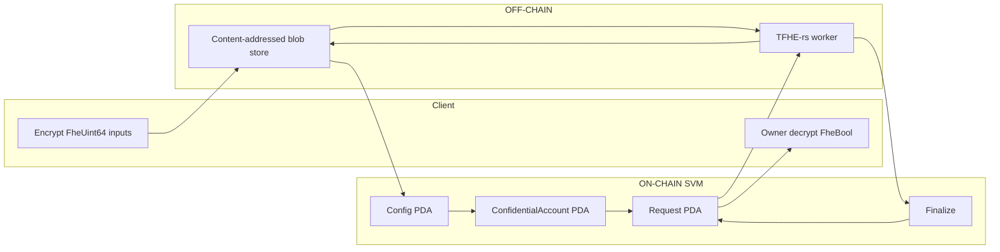
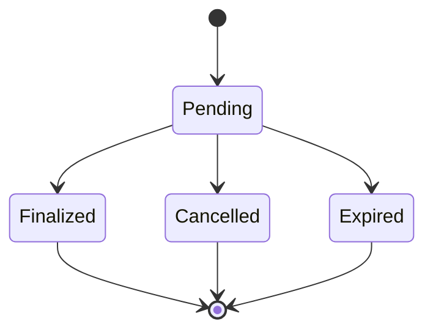

# solana-fhe-confidential-token-lab

## Overview

This repository is an independent research prototype. It asks whether
programmable encrypted policy evaluation can be coordinated on Solana
without placing TFHE execution inside SBF.

The implemented foundation uses a split architecture:

- SVM-native authorization, account binding, and request lifecycle
- off-chain TFHE-rs evaluation of a fixed encrypted predicate
- authenticated asynchronous finalization of an encrypted Boolean handle

Phase 1 uses Zama's open-source TFHE-rs library as the actual FHE
implementation in the native Rust worker, not as an architectural
reference. The worker evaluates the encrypted predicate with TFHE-rs;
the SVM coordinator never runs TFHE.

The project has completed Phase 1 SVM-native FHE coordination on Solana
Devnet (2026-08-25) and Phase 2 OpenZeppelin Relayer integration
(2026-08-26). See [Live Devnet Validation](#live-devnet-validation) and
[OpenZeppelin Relayer Devnet Validation](#openzeppelin-relayer-devnet-validation).

This is an independent research prototype built with Solana/Anchor and
Zama's TFHE-rs. It has not been audited and is not intended for
production or real-value custody.

## Why this project exists

Token-2022 Confidential Transfer already hides transfer amounts and
account balances using ElGamal encryption and zero-knowledge proofs.
That extension authorizes confidential movement of token value. It does
not evaluate arbitrary encrypted predicates over those values.

TFHE-rs can evaluate comparisons and Boolean combinations over
ciphertexts without decrypting the operands. That is a different
capability: programmable encrypted computation, not confidential
settlement.

This repository keeps both problems in scope. Token-2022 remains on
the interoperability roadmap rather than a replaced subsystem.
FHE does not replace Token-2022 Confidential Transfer.

## Phase 1

Phase 1 implements one encrypted policy:

```text
allowed =
    (encrypted_balance >= encrypted_amount)
    &&
    (encrypted_amount <= encrypted_limit)
```

All three inputs are `FheUint64` ciphertexts. The worker evaluates
`ge`, `le`, and Boolean `and` over those ciphertexts. The output is an
`FheBool`. Finalize stores a content hash of that ciphertext. The
coordinator never sees plaintext balance, amount, limit, or `allowed`.

The account owner may decrypt the finalized Boolean locally.

Phase 1 does not transfer token value. A finalized `allowed = true`
handle is not an authorization to move funds.

Implemented in this tree:

- canonical request and result encodings
- coordinator program with Config, ConfidentialAccount, and Request PDAs
- real TFHE-rs policy evaluation outside SBF
- Ed25519 operator authentication over the canonical result bytes
- local content-addressed ciphertext store
- owner-side decryption
- protocol, worker, coordinator, and end-to-end tests
- recorded Solana Devnet end-to-end validation (2026-08-25)

## Architecture



TFHE execution is only in the native worker. The on-chain crate does
not depend on `tfhe`.

Data flow:

1. The client encrypts balance, amount, and limit and writes blobs
   named by SHA-256 of the wrapped ciphertext.
2. On-chain accounts store 32-byte hashes, mint, owner, versions, and
   the pending request lock.
3. `submit` creates a Request PDA bound to those hashes and to
   config/mint/account/nonce/epoch/expiry.
4. The worker loads blobs by committed hash, checks metadata, evaluates
   the fixed circuit, stores the encrypted Boolean, and signs the
   canonical result payload.
5. A finalizer/relayer submits native Ed25519 verify plus `finalize`.
6. The owner loads the result blob and decrypts with the client key.

The same sequence was completed on Solana Devnet over direct JSON-RPC
and again with OpenZeppelin Relayer as the finalize transport. Recorded
evidence is in [Live Devnet Validation](#live-devnet-validation) and
[OpenZeppelin Relayer Devnet Validation](#openzeppelin-relayer-devnet-validation).

## Live Devnet Validation

Successfully validated end-to-end on Solana Devnet on 2026-08-25.

Zama TFHE-rs performed the actual off-chain homomorphic evaluation. The
SVM-native coordinator handled authorization, state binding, lifecycle,
and finalization. Heavy FHE computation remained off-chain.

```text
plaintext inputs
    ↓
local TFHE encryption
    ↓
Solana Devnet Config + ConfidentialAccount
    ↓
Request PDA
    ↓
authoritative request reconstruction from on-chain state
    ↓
off-chain Zama TFHE-rs evaluation
    ↓
encrypted FheBool + worker Ed25519 signature
    ↓
native Solana Ed25519 verification + coordinator finalize
    ↓
Finalized Request PDA
    ↓
local owner decryption
```

| Field | Value |
| --- | --- |
| Policy | `(balance >= amount) && (amount <= limit)` |
| Inputs | balance = 100, amount = 25, limit = 50 |
| Expected result | `true` |
| Observed decrypted result | `true` |

The worker signed the encrypted result. The finalizer consumed that
worker-produced signature and did not load or re-sign with the operator
private key. Native Ed25519 verification and coordinator `finalize`
happened atomically in the Solana transaction.

After finalization the Request PDA was fetched again and verified:

- status = `Finalized`
- `result_hash` matched
- `result_digest` matched

> Signature authenticity is not proof of correct FHE execution.

The current research prototype trusts the configured FHE operator for
computation correctness and liveness. The Ed25519 signature proves that
the configured operator attested to the exact request/result binding; it
does not cryptographically prove that the TFHE circuit was evaluated
correctly.

This remains an independent research prototype. It is not audited and
is not for production or real-value use. The mint in this run is a
synthetic identity binding, not a Token-2022 mint. No Token-2022
settlement or value movement is implemented. The Devnet deployment
remains upgradeable under the research deployer authority; this is
not a production governance model.

### On-chain evidence

| Artifact | Devnet |
| --- | --- |
| Program | [`2xNTgr7PmWSQRqGcMuCVhdTQLRP8bexVHGJ2CjxiJM6X`](https://explorer.solana.com/address/2xNTgr7PmWSQRqGcMuCVhdTQLRP8bexVHGJ2CjxiJM6X?cluster=devnet) |
| ProgramData | [`CcJyvUskFWogVNjWNJNKoRFRWV9sGP5kzCWZYmha2srY`](https://explorer.solana.com/address/CcJyvUskFWogVNjWNJNKoRFRWV9sGP5kzCWZYmha2srY?cluster=devnet) |
| Config PDA | [`ArcJZorD7NpZgRBEmop9zvdereskEkYKUtLjCWccwpEy`](https://explorer.solana.com/address/ArcJZorD7NpZgRBEmop9zvdereskEkYKUtLjCWccwpEy?cluster=devnet) |
| ConfidentialAccount PDA | [`3r7tdVwvFe1wJUWMff8sHrGGP3ECpCfdfitbiu5A9Gdm`](https://explorer.solana.com/address/3r7tdVwvFe1wJUWMff8sHrGGP3ECpCfdfitbiu5A9Gdm?cluster=devnet) |
| Request PDA | [`CkEboNwFdMM3U5KtPkpFd92SxwKzFhcA5UG7Tjms4YEx`](https://explorer.solana.com/address/CkEboNwFdMM3U5KtPkpFd92SxwKzFhcA5UG7Tjms4YEx?cluster=devnet) |
| Program deployment transaction | [`5sHnPar5AuRztnNyNmE1uvc7H9aGkHrxjzwrJhqcmN7K3LW1sucusuiTyGzWwFfK9YNV5DgiSRFtG2R7Zbf5VNF8`](https://explorer.solana.com/tx/5sHnPar5AuRztnNyNmE1uvc7H9aGkHrxjzwrJhqcmN7K3LW1sucusuiTyGzWwFfK9YNV5DgiSRFtG2R7Zbf5VNF8?cluster=devnet) |
| Initialize transaction | [`2ZD98MmyUYDeGLJuZwULrEzAdfcwx2bRntpNR84UxVExTEvd5ejAJe6vtVMNnNat8bcbTpX41eMgmSr8o99dJnN7`](https://explorer.solana.com/tx/2ZD98MmyUYDeGLJuZwULrEzAdfcwx2bRntpNR84UxVExTEvd5ejAJe6vtVMNnNat8bcbTpX41eMgmSr8o99dJnN7?cluster=devnet) |
| Create-account transaction | [`2LMjwgKk9p8ih3d4ugSZgTFDipJcRovL9KbshPEy7XfoKguKneGqShzoY4B5fK2G7nNhoiJg9pQjFih3xx6vCsjM`](https://explorer.solana.com/tx/2LMjwgKk9p8ih3d4ugSZgTFDipJcRovL9KbshPEy7XfoKguKneGqShzoY4B5fK2G7nNhoiJg9pQjFih3xx6vCsjM?cluster=devnet) |
| Submit transaction | [`5grJ3jWzfmbtBDiPhtdtm52TqPW4RLDsHup1iSTCaKQ82a9pTwiUuZfU5DUhdY7hRKqCdAJjBi4NppKZfowcpgMv`](https://explorer.solana.com/tx/5grJ3jWzfmbtBDiPhtdtm52TqPW4RLDsHup1iSTCaKQ82a9pTwiUuZfU5DUhdY7hRKqCdAJjBi4NppKZfowcpgMv?cluster=devnet) |
| Finalize transaction | [`uR1e8UhcYskWhjpC9xBPc8QVXTnHkPtmyRQmHkEG39hqtmQWKX29ABikF1QwUPc49MbeddAGutMuvemRb5Z3Z6V`](https://explorer.solana.com/tx/uR1e8UhcYskWhjpC9xBPc8QVXTnHkPtmyRQmHkEG39hqtmQWKX29ABikF1QwUPc49MbeddAGutMuvemRb5Z3Z6V?cluster=devnet) |
| Result hash | `1c329fbf12d734f2250b165e05bcfc7b9015125de0c982eefd4a2e07555db5cc` |
| Result digest | `c7b8cb49b35a70b20d6a6f23a9ba8e0dbf78dd59afb6e457f9dbddb33c065162` |

### What Devnet proves

| Proves | Does not prove |
| --- | --- |
| Real-cluster encrypt → submit → TFHE-rs evaluate → finalize → decrypt | Trustless or verifiable FHE execution |
| Coordinator authorization, binding, lifecycle, and atomic finalize | Token-2022 interoperability or value movement |
| Finalizer consumes the worker-produced signature as-is and never loads the operator private key | Audited or production-ready security |
| Request PDA `Finalized` with matching result hash and digest | Endorsement by Solana, Zama, or OpenZeppelin |

## OpenZeppelin Relayer Devnet Validation

Phase 2 was successfully validated end-to-end on Solana Devnet on
2026-08-26 using OpenZeppelin Relayer v1.5.0 as the transaction
delivery and fee-paying finalization transport.

The OpenZeppelin Relayer transport has been validated on Solana Devnet.
It remains research infrastructure and has not been audited for
production use. Direct JSON-RPC finalize remains available and remains
the default transport.

```text
Zama TFHE-rs worker
        ↓
encrypted FheBool
+ worker Ed25519 signature
        ↓
shared finalization validation
        ↓
OpenZeppelin Relayer v1.5.0
        ↓
Solana transaction signing / fee payment
        ↓
native Ed25519 verify
        ↓
coordinator finalize
        ↓
Finalized Request PDA
        ↓
owner decrypt
```

| Field | Value |
| --- | --- |
| Relayer version | v1.5.0 |
| Relayer ID | `solana-devnet` |
| Relayer network | `devnet` (`network_type=solana`, `fee_payment_strategy=relayer`) |
| Relayer Solana address | [`4mHtzBqv2UeYGYZxarRhjGEXR2ckk8W36uy2vN5phcyN`](https://explorer.solana.com/address/4mHtzBqv2UeYGYZxarRhjGEXR2ckk8W36uy2vN5phcyN?cluster=devnet) |
| FHE operator | `FEdV611QSANXrnKFwmdRdnfUgfM1vgqCeimjJEmboyt8` |
| Request PDA | [`5J3QZNuNoYjdXAWtYfagcjPLXpquMJkqfgaMCpqSXZuU`](https://explorer.solana.com/address/5J3QZNuNoYjdXAWtYfagcjPLXpquMJkqfgaMCpqSXZuU?cluster=devnet) |
| Relayer job ID | `49e3f3c3-3099-434e-b00e-a2dc24fe79ab` |
| Solana transaction | [`2HhYWewR78Egbe31ot18y9gbdQB4D9tEpKftAbX4H4bp6EejU9bukKHJKN85kynZdUxbFXLdenA8rS7PPKJMAzQD`](https://explorer.solana.com/tx/2HhYWewR78Egbe31ot18y9gbdQB4D9tEpKftAbX4H4bp6EejU9bukKHJKN85kynZdUxbFXLdenA8rS7PPKJMAzQD?cluster=devnet) |
| Result hash | `28a2492fce06d50104e659de477f11e2caf72f75471450229344e1df2d65a5ad` |
| Result digest | `c6c60c97224936c5dd25696e91fb8761e681b30c6619252b3f606bff79e8d737` |
| Observed decrypted result | `true` |

Policy: `(balance >= amount) && (amount <= limit)`. Inputs: balance =
100, amount = 25, limit = 50. Expected and observed decrypted result:
`true`. Request nonce = 2.

The worker signed the encrypted result before the Relayer was involved.
The Relayer path consumed that signature as-is and did not re-sign the
result. Native Ed25519 verification immediately preceded coordinator
`finalize`. The coordinator verified `Config.operator`, not the Relayer
payer.

After Relayer confirmation the client did not trust the HTTP response
alone. It re-fetched the Request PDA from Solana and verified:

- status = `Finalized`
- `result_hash` matched
- `result_digest` matched
- `pending_request` cleared
- `state_version` advanced from 1 to 2

> Signature authenticity is not proof of correct FHE execution.

The current research prototype still trusts the configured FHE operator
for computation correctness and liveness. Relayer delivery does not
make FHE execution trustless.

This remains an independent research prototype. It is not audited and
is not for production or real-value use. No Token-2022 settlement or
value movement is implemented. OpenZeppelin did not review, sponsor,
approve, or endorse this project.

### Operator vs Relayer

| Role | Address | Job |
| --- | --- | --- |
| FHE operator | `FEdV611QSANXrnKFwmdRdnfUgfM1vgqCeimjJEmboyt8` | Evaluates the encrypted predicate and signs the canonical result. Does not sign or pay the Solana transaction. |
| OpenZeppelin Relayer payer | [`4mHtzBqv2UeYGYZxarRhjGEXR2ckk8W36uy2vN5phcyN`](https://explorer.solana.com/address/4mHtzBqv2UeYGYZxarRhjGEXR2ckk8W36uy2vN5phcyN?cluster=devnet) | Signs and pays the Solana transaction. Does not receive or load the FHE operator private key. |

These are different keys and different roles. The Relayer consumes the
already-produced worker signature and signs only the Solana
transaction.

## Request Lifecycle



Worker-internal execution is not consensus state. There is no
Processing or Completed status.

Rules:

- at most one pending request per ConfidentialAccount
- nonce increases on submit and is never reused after lock release
- finalize, cancel, and expire are each terminal
- cancelled or expired requests cannot finalize
- finalize requires unchanged bound state version, nonce, key version,
  and operator epoch
- the signed result must match the exact on-chain request digest

## Trust Model

- TFHE computation is real. The worker evaluates the predicate without
  decrypting operands or the result.
- Phase 1 uses a single operator. That operator is trusted for result
  correctness and liveness.
- An Ed25519 signature proves that the configured operator attested a
  specific result hash for a specific request. It is not a proof that
  the FHE circuit was evaluated correctly.
- Client and operator keys are local files. This is not a KMS.
- Ciphertext availability is a local directory. There is no durable
  network store.

## Security Model

Authenticated request bytes bind:

- protocol version and domain id
- program, config, mint, confidential account, request PDA
- operation id
- balance, amount, and limit ciphertext hashes
- parameter commitment (`params_hash`)
- state version, request nonce, key version, operator epoch
- expiry slot

Authenticated result bytes additionally bind:

- the exact request digest
- result ciphertext hash
- result type and circuit id

A ciphertext hash is an integrity reference, not a capability.

The coordinator rejects signer, owner, PDA, config, mint, account,
request, status, nonce, state-version, operation, key-version,
operator, operator-epoch, expiry, and result-digest mismatches. It
rejects a second in-flight request, duplicate finalize, finalize after
cancel or expiry, zero ciphertext hashes, and an Ed25519 instruction
that does not carry the expected operator and message.

Lock release clears `pending_request` and increments `state_version`.
It does not decrement the nonce.

## Privacy Boundary

Hidden from the coordinator and from public account data:

- plaintext balance, amount, and limit
- plaintext `allowed`

Public:

- mint, owner, config, request PDA
- ciphertext hashes and the parameter commitment
- request status, nonce, versions, operator pubkey, epoch, expiry
- that a policy check was requested

This is confidentiality of selected numeric inputs and of the Boolean
result. It is not anonymity and not hiding of participation.

## Repository Structure

- `crates/protocol` — canonical encodings, domain separators, and
  digest helpers shared by the program and host crates.
- `programs/confidential-coordinator` — Anchor coordinator. Stores
  bindings and verifies the operator signature. Does not evaluate TFHE.
- `crates/fhe-worker` — native TFHE-rs circuit, blob store, and
  process-once worker CLI.
- `crates/client` — `confidential-lab` CLI: key setup, encrypt,
  evaluate, decrypt, local LiteSVM demo, and measurements.
- `tests/integration` — LiteSVM coordinator tests and the Phase 1
  end-to-end path.

## Running Locally

Verified on this machine with rustc 1.97.1 and `cargo-build-sbf`
3.1.10 (SBF rustc 1.89.0). Host crates need a Rust version accepted by
TFHE-rs 1.7.0. Do not use an older `anchor` CLI to build the program.

Build the SBF coordinator first. Tests and `demo` load
`target/deploy/confidential_coordinator.so`.

```bash
cargo build-sbf --manifest-path programs/confidential-coordinator/Cargo.toml
```

Format, lint, and test:

```bash
cargo fmt --all --check
cargo clippy --workspace --all-targets -- -D warnings
cargo test --workspace -- --test-threads=1
```

`--all-features` is not used. The coordinator has no TFHE feature; the
workspace already keeps `tfhe` off the SBF graph.

Runtime keys and ciphertexts are written under `.data/`, which is
gitignored. Do not commit those files.

## Demo

Shortest Phase 1 path. `demo` initializes local FHE keys, encrypts
inputs, creates coordinator state in LiteSVM, submits, evaluates with
TFHE-rs, finalizes with an operator Ed25519 signature, and decrypts
the Boolean as the account owner.

```bash
cargo run -p confidential-lab --release -- --data-dir .data/demo-allowed \
  demo --balance 100 --amount 25 --limit 50
```

Expected last line:

```text
result: true
```

Denied case:

```bash
cargo run -p confidential-lab --release -- --data-dir .data/demo-denied \
  demo --balance 20 --amount 25 --limit 50
```

Expected last line:

```text
result: false
```

Owner decrypt of a completed demo directory:

```bash
cargo run -p confidential-lab --release -- --data-dir .data/demo-allowed decrypt
```

Manual pieces used by the same local layout:

```bash
cargo run -p confidential-lab --release -- --data-dir .data/manual setup
cargo run -p confidential-lab --release -- --data-dir .data/manual encrypt \
  --balance 100 --amount 25 --limit 50
```

Standalone worker, after a `demo` directory exists:

```bash
cargo run -p fhe-worker --release -- evaluate \
  --request .data/demo-allowed/request.json \
  --store .data/demo-allowed/ciphertexts \
  --server-key .data/demo-allowed/keys/server.bin \
  --operator .data/demo-allowed/keys/operator.json \
  --out .data/demo-allowed/result-reeval.json
```

The worker prints only `result_hash`. It does not decrypt.

## Devnet Workflow

`demo` and `phase1-tests` exercise config/account/submit/finalize against
LiteSVM only. A separate `devnet` subcommand set drives the deployed
coordinator over real Solana RPC instead. It is transport/RPC work only:
the on-chain program, account layouts, and digest scheme are unchanged.

The coordinator is deployed on Devnet. A client-driven direct-RPC
end-to-end run completed on 2026-08-25; see
[Live Devnet Validation](#live-devnet-validation). An OpenZeppelin
Relayer finalize of a later pending request completed on 2026-08-26;
see [OpenZeppelin Relayer Devnet Validation](#openzeppelin-relayer-devnet-validation).
The commands below are the manual path used for those runs.

The "mint" used by `devnet initialize` is a synthetic Phase-1 identity
binding (a freshly generated pubkey used only to derive PDAs) and not a
Token-2022 mint; no token accounts or transfers are involved.

```bash
cargo run -p confidential-lab --release -- --data-dir .data/devnet setup
cargo run -p confidential-lab --release -- --data-dir .data/devnet encrypt \
  --balance 100 --amount 25 --limit 50

cargo run -p confidential-lab --release -- --data-dir .data/devnet devnet initialize \
  --max-request-lifetime-slots 10000
cargo run -p confidential-lab --release -- --data-dir .data/devnet devnet create-account \
  --balance-hash <balance_hash> --limit-hash <limit_hash>
cargo run -p confidential-lab --release -- --data-dir .data/devnet devnet submit \
  --amount-hash <amount_hash>

cargo run -p confidential-lab --release -- --data-dir .data/devnet evaluate
cargo run -p confidential-lab --release -- --data-dir .data/devnet devnet finalize

cargo run -p confidential-lab --release -- --data-dir .data/devnet devnet inspect
cargo run -p confidential-lab --release -- --data-dir .data/devnet decrypt
```

`--payer`/`--authority`/`--owner` default to `~/.config/solana/id.json` and
can be overridden per command. `devnet-state.json` under the data directory
caches public addresses, the RPC URL, hashes/versions, the latest request
pointer, and optional keypair *file paths* (`payer_keypair_path`,
`authority_keypair_path`, `owner_keypair_path`). It never stores private
key bytes. `devnet finalize` consumes the worker's existing `result.json`
signature as-is and never loads the operator's private key, so the worker
and the finalizer/relayer can be different principals.

### OpenZeppelin Relayer transport

The OpenZeppelin Relayer transport has been validated on Solana Devnet.
It remains research infrastructure and has not been audited for
production use. Direct JSON-RPC remains the default path.

A local OpenZeppelin Relayer used with this client needs approximately:

```json
{
  "network": "devnet",
  "network_type": "solana",
  "policies": {
    "fee_payment_strategy": "relayer"
  }
}
```

The Relayer Solana signer pays and signs the transaction. Fund it with
Devnet SOL. Do not use the FHE operator key as the Relayer signer.

If `allowed_programs` is set, it must permit both
`Ed25519SigVerify111111111111111111111111111` and the coordinator
`2xNTgr7PmWSQRqGcMuCVhdTQLRP8bexVHGJ2CjxiJM6X`.

The Relayer API secret comes only from the
`OPENZEPPELIN_RELAYER_API_KEY` environment variable. Do not pass it as a
CLI flag (`--api-key` or `--api-key=...`) and do not store it in
`devnet-state.json`.

```bash
cargo run -p confidential-lab --release -- --data-dir .data/devnet devnet finalize
cargo run -p confidential-lab --release -- --data-dir .data/devnet devnet finalize \
  --transport direct
cargo run -p confidential-lab --release -- --data-dir .data/devnet devnet finalize \
  --transport openzeppelin \
  --relayer-url http://127.0.0.1:8080 \
  --relayer-id solana-devnet
```

The FHE operator key signs the computation result; the Relayer Solana
signer only signs and pays the transaction. Those roles stay separate.

## Tests

```bash
cargo test -p confidential-protocol
cargo test -p fhe-worker --lib
cargo test -p phase1-tests --test program
cargo test -p phase1-tests --test e2e
```

Or the workspace command above. `--test-threads=1` avoids concurrent
TFHE server-key activation.

Verified counts on this machine:

- 9 `confidential-protocol` tests: canonical request/result encoding,
  domain separation, per-field digest changes, golden vectors, blob
  metadata checks
- 12 `fhe-worker` tests: real TFHE policy cases (100/25/50 true,
  20/25/50 false, 100/60/50 false), equality and zero boundaries,
  safe serialize/deserialize, modified and invalid ciphertext, wrong
  parameter metadata, and server-key commitment checks
- 19 `phase1-tests` program tests: initialize, create, submit,
  finalize, cancel, expire, and substitution/replay rejects
- 1 end-to-end test: encrypt, submit, TFHE evaluate, sign, finalize,
  owner decrypt for allowed and both denied cases
- 1 coordinator `test_id` unit test
- 43 `confidential-lab` Devnet/RPC/Relayer tests: previous Devnet/RPC security
  coverage plus OpenZeppelin Relayer info validation, instruction
  serialization, Ed25519/finalize adjacency, transport defaults, mock REST
  submit/poll/error paths, Relayer confirmation/timeout hardening, and shared
  post-finalize verification
- 85 application tests

`cargo test --workspace --all-targets --all-features` reports 88 tests.
The additional 3 are Anchor-generated IDL print tests. This is a count
clarification only; Phase 3 did not add tests.

## Measurements

Recorded on Apple M5 Max, macOS aarch64, 64 GB RAM, rustc 1.97.1,
TFHE-rs 1.7.0 default parameter set, release host binaries.

```text
keygen_ms: 687
encrypt_three_ms: 2
policy_ms: 204
client_key_bytes: 31458
compressed_server_key_bytes: 60228264
server_key_bytes: 180610890
u64_ciphertext_bytes: 528101
bool_ciphertext_bytes: 16593
submit_cu: 63718
finalize_cu: 113395
```

`params_hash` is SHA-256 of the safe-serialized `CompressedServerKey`.
TFHE-rs 1.7.0 `Config` is not safe-serializable.

```bash
cargo run -p confidential-lab --release -- measure
```

## Limitations

- Single operator. Signature authenticity is not circuit correctness.
- Local blob store. Lost files cannot be reconstructed from on-chain
  hashes.
- Local client-key custody. Compromise decrypts all blobs under that
  key.
- Default TFHE parameter set. Ciphertexts are hundreds of kilobytes;
  the evaluation key is tens to hundreds of megabytes.
- Fixed circuit only. The worker rejects unknown operations.
- No Token-2022 CPI, no confidential transfer, no value movement.
- No threshold KMS, no coprocessor quorum, no durable availability.
- `demo` and tests use LiteSVM. Recorded Solana Devnet end-to-end
  runs are in [Live Devnet Validation](#live-devnet-validation) and
  [OpenZeppelin Relayer Devnet Validation](#openzeppelin-relayer-devnet-validation).
- Host rustc and SBF rustc differ; SBF builds go through
  `cargo-build-sbf`, not the workspace host toolchain.

## Token-2022 Interoperability

Token-2022 Confidential Transfer is planned later-phase research and
implementation, not a feature of the current tree.

Confidential Transfer uses ElGamal ciphertexts and ZK proofs to move
token value while hiding amounts. This repository investigates a
complementary boundary: an FHE policy result that could later gate
authorization without revealing the compared values.

The current mint is only a synthetic identity binding on Config,
ConfidentialAccount, and Request so a later mint-to-extension mapping
is not blocked by the account layout. The current code does not call
Token-2022 and does not interpret an FHE Boolean as a transfer
authorization.

Proof-to-policy and security binding — including cluster deployment of
the Confidential Transfer and ZK ElGamal proof programs — must be
designed before interoperability is claimed.

## Project Phases

### Phase 1 — SVM-Native FHE Coordination

Implemented and validated on Solana Devnet.

- canonical request/result protocol with domain-separated encodings
- real Zama TFHE-rs encrypted policy evaluation
- SVM-native Config, ConfidentialAccount, and Request PDAs
- one-active-request lifecycle locking
- authoritative request reconstruction from on-chain state
- worker Ed25519 result authentication
- worker/finalizer role separation
- replay, substitution, stale-state, and lifecycle checks
- owner-side decryption of the encrypted Boolean
- local LiteSVM adversarial tests
- successful end-to-end Solana Devnet validation with recorded
  transaction/PDA evidence

### Phase 2 — OpenZeppelin Relayer Integration

Implemented and validated on Solana Devnet.

- optional OpenZeppelin Relayer v1.5.0 finalize transport
- direct JSON-RPC remains the default and reference path
- Relayer Solana address used as transaction payer/signer
- worker/operator signature remains independent of Relayer
- operator private key never reaches the Relayer path
- native Ed25519 verify immediately preceding coordinator finalize
- authoritative Request PDA verified after Relayer confirmation
- successful Devnet E2E recorded with transaction evidence

Protocol logic remains independent of the transport layer. OpenZeppelin
Relayer does not receive the FHE operator private key; it consumes the
worker-produced signature and acts as transaction infrastructure.

### Phase 3 — Confidential-Contract Security Mapping

Implemented as a security architecture and threat-model mapping.

- maps OpenZeppelin Confidential Contracts / Zama FHEVM security
  assumptions to SVM-native semantics
- documents authorization, lifecycle, replay, asynchronous finalization,
  result authentication, key/version handling and ciphertext availability
- separates directly applicable patterns from EVM-specific assumptions
- documents residual trust in the FHE operator
- does not change the on-chain protocol

[Confidential Contracts / FHEVM → SVM Security Mapping](docs/confidential-contracts-svm-security-mapping.md)

### Phase 4 — Token-2022 Confidential Interoperability

Planned research and implementation. This phase investigates the
boundary between Token-2022 Confidential Transfer's ElGamal/ZK
confidential settlement model and TFHE-backed programmable encrypted
policy evaluation. The problem is not simply "call Token-2022".

The design must address:

- ElGamal/ZK state ↔ TFHE ciphertext binding
- source-of-truth rules
- proof-to-policy adapters
- key/encryption-domain differences
- numeric-domain constraints
- pending confidential balances
- replay/stale-policy resistance
- upgrade/governance assumptions

FHE is complementary to Token-2022 Confidential Transfer, not a
replacement.

### Phase 5 — Confidential Policy-Governed Settlement

Planned only after the Phase 4 security model is resolved. This
explores confidential value movement conditioned on encrypted policy
evaluation. No value movement is implemented today.

A `Finalized` Request does NOT mean `allowed = true`. Finalization
only means an authenticated encrypted computation result was
recorded. Settlement and authorization semantics must be specified
separately.

### Phase 6 — OpenZeppelin Monitor / Operational Security

Planned. This phase explores OpenZeppelin Monitor around the deployed
Solana coordinator for operational and security visibility where
practical. OpenZeppelin Monitor is not currently integrated.

Potential observations:

- configuration changes
- operator rotation
- pause/unpause
- finalization activity
- lifecycle anomalies
- suspicious/failed interactions

Monitoring does not change the protocol's computation-correctness
assumptions.

### Phase 7 — Trust Minimization

Research directions, not implemented:

- multi-operator/quorum attestation
- verifiable computation
- threshold key management
- durable ciphertext availability
- stronger operator/key rotation models
- production governance / upgrade controls

A quorum should not be described as trustless; the objective is to
incrementally reduce the current single-operator trust assumption.

## Token-2022 vs FHE

| | Token-2022 Confidential Transfer | This Phase 1 FHE path |
| --- | --- | --- |
| Primary job | Confidential token settlement | Encrypted predicate evaluation |
| Encryption | ElGamal over transfer amounts and balances | TFHE over `FheUint64` policy inputs |
| Authorization | ZK proofs verified on-chain | Operator signature over a result hash |
| On-chain work | Proof and transfer program execution | Binding, lock, and signature checks |
| Revealed to chain | Participation and proofs, not amounts | Participation, hashes, and status |
| Value movement | Yes, when proofs verify | No |
| Programmable comparisons | Not the extension's role | `ge` / `le` / `and` over ciphertexts |
| Trust | Proof verification | Single operator for integrity |

Neither column is a substitute for the other.

## Related Work and Design References

- Solana Token-2022 Confidential Transfer:
  [Confidential Transfer integration guide](https://solana.com/docs/tokens/extensions/confidential-transfer/integration-guide)
- TFHE-rs: [TFHE-rs documentation](https://docs.zama.org/tfhe-rs) and
  [zama-ai/tfhe-rs](https://github.com/zama-ai/tfhe-rs)
- Public Zama FHE architecture:
  [Zama protocol documentation](https://docs.zama.org/protocol)
- OpenZeppelin Confidential Contracts and ERC-7984:
  [Confidential Contracts](https://docs.openzeppelin.com/confidential-contracts)
  and [ERC-7984](https://eips.ethereum.org/EIPS/eip-7984)

OpenZeppelin Relayer v1.5.0 is used as an optional Solana finalization
transport. OpenZeppelin Confidential Contracts remains an EVM/fhEVM
architectural and security reference. OpenZeppelin Monitor remains
planned. This repository does not vendor OpenZeppelin Confidential
Contracts source.

This is an independent research project. OpenZeppelin did not review,
sponsor, approve, or endorse it. EVM ACL, callback, and storage
assumptions are not copied directly into the SVM coordinator.

## License / Third-Party Notice

This repository is licensed under Apache License 2.0. See `LICENSE`.

Major host dependency: TFHE-rs (`tfhe` 1.7.0), licensed under
BSD-3-Clause-Clear. That license does not grant patent rights.
Commercial use of TFHE-rs may require a separate patent license from
Zama. See `NOTICE`.

Solana and Anchor crates used here are Apache-2.0. Their use does not
create affiliation or endorsement.

This notice does not grant or imply third-party patent rights.

## Disclaimer

Research prototype. No audit. No production use. No real-value
custody. Do not treat a finalized encrypted Boolean as a token
transfer authorization.
