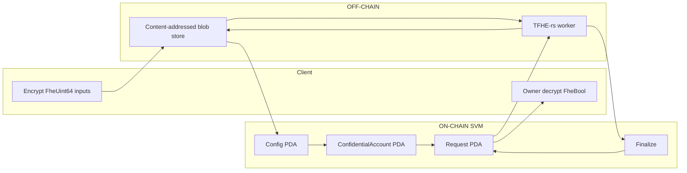
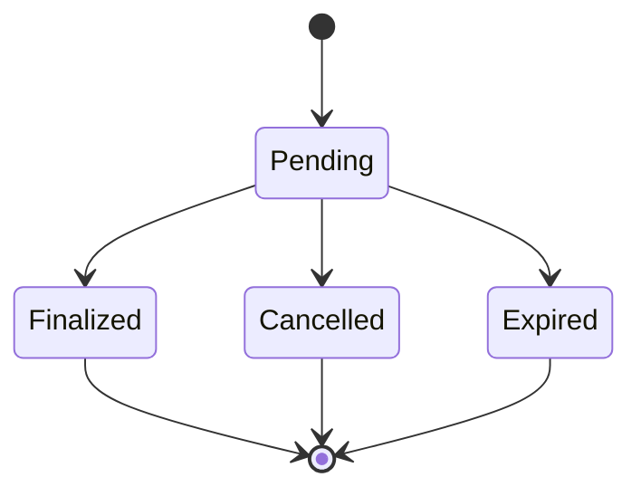

# solana-fhe-confidential-token-lab

## Overview

This repository is an independent research prototype. It asks whether
programmable encrypted policy evaluation can be coordinated on Solana
without placing TFHE execution inside SBF.

The Phase 1 answer is a split architecture:

- SVM-native authorization, account binding, and request lifecycle
- off-chain TFHE-rs evaluation of a fixed encrypted predicate
- authenticated asynchronous finalization of an encrypted Boolean handle

Phase 1 uses Zama's open-source TFHE-rs library for the actual
homomorphic computation performed by the native Rust worker.

This is an independent research prototype built with Solana/Anchor and Zama's
TFHE-rs. It has not been audited and is not intended for production or
real-value custody.

## Why this project exists

Token-2022 Confidential Transfer already hides transfer amounts and
account balances using ElGamal encryption and zero-knowledge proofs.
That extension authorizes confidential movement of token value. It does
not evaluate arbitrary encrypted predicates over those values.

TFHE-rs can evaluate comparisons and Boolean combinations over
ciphertexts without decrypting the operands. That is a different
capability: programmable encrypted computation, not confidential
settlement.

This repository keeps both problems in scope. Token-2022 remains on the
roadmap as Phase 2 interoperability rather than a replaced subsystem.
FHE does not replace Token-2022 Confidential Transfer.

## Phase 1

Phase 1 implements one encrypted policy:

```text
allowed =
    (encrypted_balance >= encrypted_amount)
    &&
    (encrypted_amount <= encrypted_limit)
```

All three inputs are `FheUint64` ciphertexts. The worker evaluates
`ge`, `le`, and Boolean `and` over those ciphertexts. The output is an
`FheBool`. Finalize stores a content hash of that ciphertext. The
coordinator never sees plaintext balance, amount, limit, or `allowed`.

The account owner may decrypt the finalized Boolean locally.

Phase 1 does not transfer token value. A finalized `allowed = true`
handle is not an authorization to move funds.

Implemented in this tree:

- canonical request and result encodings
- coordinator program with Config, ConfidentialAccount, and Request PDAs
- real TFHE-rs policy evaluation outside SBF
- Ed25519 operator authentication over the canonical result bytes
- local content-addressed ciphertext store
- owner-side decryption
- protocol, worker, coordinator, and end-to-end tests

## Architecture



TFHE execution is only in the native worker. The on-chain crate does
not depend on `tfhe`.

Data flow:

1. The client encrypts balance, amount, and limit and writes blobs
   named by SHA-256 of the wrapped ciphertext.
2. On-chain accounts store 32-byte hashes, mint, owner, versions, and
   the pending request lock.
3. `submit` creates a Request PDA bound to those hashes and to
   config/mint/account/nonce/epoch/expiry.
4. The worker loads blobs by committed hash, checks metadata, evaluates
   the fixed circuit, stores the encrypted Boolean, and signs the
   canonical result payload.
5. A relayer submits native Ed25519 verify plus `finalize`.
6. The owner loads the result blob and decrypts with the client key.

## Request Lifecycle



Worker-internal execution is not consensus state. There is no
Processing or Completed status.

Rules:

- at most one pending request per ConfidentialAccount
- nonce increases on submit and is never reused after lock release
- finalize, cancel, and expire are each terminal
- cancelled or expired requests cannot finalize
- finalize requires unchanged bound state version, nonce, key version,
  and operator epoch
- the signed result must match the exact on-chain request digest

## Trust Model

- TFHE computation is real. The worker evaluates the predicate without
  decrypting operands or the result.
- Phase 1 uses a single operator. That operator is trusted for result
  correctness and liveness.
- An Ed25519 signature proves that the configured operator attested a
  specific result hash for a specific request. It is not a proof that
  the FHE circuit was evaluated correctly.
- Client and operator keys are local files. This is not a KMS.
- Ciphertext availability is a local directory. There is no durable
  network store.

## Security Model

Authenticated request bytes bind:

- protocol version and domain id
- program, config, mint, confidential account, request PDA
- operation id
- balance, amount, and limit ciphertext hashes
- parameter commitment (`params_hash`)
- state version, request nonce, key version, operator epoch
- expiry slot

Authenticated result bytes additionally bind:

- the exact request digest
- result ciphertext hash
- result type and circuit id

A ciphertext hash is an integrity reference, not a capability.

The coordinator rejects signer, owner, PDA, config, mint, account,
request, status, nonce, state-version, operation, key-version,
operator, operator-epoch, expiry, and result-digest mismatches. It
rejects a second in-flight request, duplicate finalize, finalize after
cancel or expiry, zero ciphertext hashes, and an Ed25519 instruction
that does not carry the expected operator and message.

Lock release clears `pending_request` and increments `state_version`.
It does not decrement the nonce.

## Privacy Boundary

Hidden from the coordinator and from public account data:

- plaintext balance, amount, and limit
- plaintext `allowed`

Public:

- mint, owner, config, request PDA
- ciphertext hashes and the parameter commitment
- request status, nonce, versions, operator pubkey, epoch, expiry
- that a policy check was requested

This is confidentiality of selected numeric inputs and of the Boolean
result. It is not anonymity and not hiding of participation.

## Repository Structure

- `crates/protocol` — canonical encodings, domain separators, and
  digest helpers shared by the program and host crates.
- `programs/confidential-coordinator` — Anchor coordinator. Stores
  bindings and verifies the operator signature. Does not evaluate TFHE.
- `crates/fhe-worker` — native TFHE-rs circuit, blob store, and
  process-once worker CLI.
- `crates/client` — `confidential-lab` CLI: key setup, encrypt,
  evaluate, decrypt, local LiteSVM demo, and measurements.
- `tests/integration` — LiteSVM coordinator tests and the Phase 1
  end-to-end path.

## Running Locally

Verified on this machine with rustc 1.97.1 and `cargo-build-sbf`
3.1.10 (SBF rustc 1.89.0). Host crates need a Rust version accepted by
TFHE-rs 1.7.0. Do not use an older `anchor` CLI to build the program.

Build the SBF coordinator first. Tests and `demo` load
`target/deploy/confidential_coordinator.so`.

```bash
cargo build-sbf --manifest-path programs/confidential-coordinator/Cargo.toml
```

Format, lint, and test:

```bash
cargo fmt --all --check
cargo clippy --workspace --all-targets -- -D warnings
cargo test --workspace -- --test-threads=1
```

`--all-features` is not used. The coordinator has no TFHE feature; the
workspace already keeps `tfhe` off the SBF graph.

Runtime keys and ciphertexts are written under `.data/`, which is
gitignored. Do not commit those files.

## Demo

Shortest Phase 1 path. `demo` initializes local FHE keys, encrypts
inputs, creates coordinator state in LiteSVM, submits, evaluates with
TFHE-rs, finalizes with an operator Ed25519 signature, and decrypts
the Boolean as the account owner.

```bash
cargo run -p confidential-lab --release -- --data-dir .data/demo-allowed \
  demo --balance 100 --amount 25 --limit 50
```

Expected last line:

```text
result: true
```

Denied case:

```bash
cargo run -p confidential-lab --release -- --data-dir .data/demo-denied \
  demo --balance 20 --amount 25 --limit 50
```

Expected last line:

```text
result: false
```

Owner decrypt of a completed demo directory:

```bash
cargo run -p confidential-lab --release -- --data-dir .data/demo-allowed decrypt
```

Manual pieces used by the same local layout:

```bash
cargo run -p confidential-lab --release -- --data-dir .data/manual setup
cargo run -p confidential-lab --release -- --data-dir .data/manual encrypt \
  --balance 100 --amount 25 --limit 50
```

Standalone worker, after a `demo` directory exists:

```bash
cargo run -p fhe-worker --release -- evaluate \
  --request .data/demo-allowed/request.json \
  --store .data/demo-allowed/ciphertexts \
  --server-key .data/demo-allowed/keys/server.bin \
  --operator .data/demo-allowed/keys/operator.json \
  --out .data/demo-allowed/result-reeval.json
```

The worker prints only `result_hash`. It does not decrypt.

## Devnet (Phase 1.1)

`demo` and `phase1-tests` exercise config/account/submit/finalize against
LiteSVM only. A separate `devnet` subcommand set drives the deployed
coordinator over real Solana RPC instead. It is transport/RPC work only:
the on-chain program, account layouts, and digest scheme are unchanged.

The coordinator program has been deployed to Devnet. A successful
client-driven Devnet end-to-end run has not been completed or recorded
yet; the commands below are the intended manual path, not a verified E2E.

The "mint" used by `devnet initialize` is a synthetic Phase-1 identity
binding (a freshly generated pubkey used only to derive PDAs) and not a
Token-2022 mint; no token accounts or transfers are involved.

```bash
cargo run -p confidential-lab --release -- --data-dir .data/devnet setup
cargo run -p confidential-lab --release -- --data-dir .data/devnet encrypt \
  --balance 100 --amount 25 --limit 50

cargo run -p confidential-lab --release -- --data-dir .data/devnet devnet initialize \
  --max-request-lifetime-slots 10000
cargo run -p confidential-lab --release -- --data-dir .data/devnet devnet create-account \
  --balance-hash <balance_hash> --limit-hash <limit_hash>
cargo run -p confidential-lab --release -- --data-dir .data/devnet devnet submit \
  --amount-hash <amount_hash>

cargo run -p confidential-lab --release -- --data-dir .data/devnet evaluate
cargo run -p confidential-lab --release -- --data-dir .data/devnet devnet finalize

cargo run -p confidential-lab --release -- --data-dir .data/devnet devnet inspect
cargo run -p confidential-lab --release -- --data-dir .data/devnet decrypt
```

`--payer`/`--authority`/`--owner` default to `~/.config/solana/id.json` and
can be overridden per command. `devnet-state.json` under the data directory
caches public addresses, the RPC URL, hashes/versions, the latest request
pointer, and optional keypair *file paths* (`payer_keypair_path`,
`authority_keypair_path`, `owner_keypair_path`). It never stores private
key bytes. `devnet finalize` consumes the worker's existing `result.json`
signature as-is and never loads the operator's private key, so the worker
and the finalizer/relayer can be different principals.

## Tests

```bash
cargo test -p confidential-protocol
cargo test -p fhe-worker --lib
cargo test -p phase1-tests --test program
cargo test -p phase1-tests --test e2e
```

Or the workspace command above. `--test-threads=1` avoids concurrent
TFHE server-key activation.

Verified counts on this machine:

- 9 `confidential-protocol` tests: canonical request/result encoding,
  domain separation, per-field digest changes, golden vectors, blob
  metadata checks
- 12 `fhe-worker` tests: real TFHE policy cases (100/25/50 true,
  20/25/50 false, 100/60/50 false), equality and zero boundaries,
  safe serialize/deserialize, modified and invalid ciphertext, wrong
  parameter metadata, and server-key commitment checks
- 19 `phase1-tests` program tests: initialize, create, submit,
  finalize, cancel, expire, and substitution/replay rejects
- 1 end-to-end test: encrypt, submit, TFHE evaluate, sign, finalize,
  owner decrypt for allowed and both denied cases
- 1 coordinator `test_id` unit test
- 15 `confidential-lab` Phase 1.1 tests: `devnet-state.json` ser/de and
  no private-key fields, tilde/path handling, PDA helpers, request-binding
  reconstruction, historical vs pending lock checks, owner/discriminator
  rejects, result/request consistency, local Ed25519 accept/reject, RPC
  error log surfacing
- 57 tests total

## Measurements

Recorded on Apple M5 Max, macOS aarch64, 64 GB RAM, rustc 1.97.1,
TFHE-rs 1.7.0 default parameter set, release host binaries.

```text
keygen_ms: 687
encrypt_three_ms: 2
policy_ms: 204
client_key_bytes: 31458
compressed_server_key_bytes: 60228264
server_key_bytes: 180610890
u64_ciphertext_bytes: 528101
bool_ciphertext_bytes: 16593
submit_cu: 63718
finalize_cu: 113395
```

`params_hash` is SHA-256 of the safe-serialized `CompressedServerKey`.
TFHE-rs 1.7.0 `Config` is not safe-serializable.

```bash
cargo run -p confidential-lab --release -- measure
```

## Limitations

- Single operator. Signature authenticity is not circuit correctness.
- Local blob store. Lost files cannot be reconstructed from on-chain
  hashes.
- Local client-key custody. Compromise decrypts all blobs under that
  key.
- Default TFHE parameter set. Ciphertexts are hundreds of kilobytes;
  the evaluation key is tens to hundreds of megabytes.
- Fixed circuit only. The worker rejects unknown operations.
- No Token-2022 CPI, no confidential transfer, no value movement.
- No threshold KMS, no coprocessor quorum, no durable availability.
- `demo` and tests use LiteSVM, not a public cluster.
- Host rustc and SBF rustc differ; SBF builds go through
  `cargo-build-sbf`, not the workspace host toolchain.

## Token-2022 Integration

Token-2022 Confidential Transfer is planned Phase 2 work, not an
out-of-scope topic.

Confidential Transfer uses ElGamal ciphertexts and ZK proofs to move
token value while hiding amounts. This repository investigates a
complementary boundary: an FHE policy result that could later gate
authorization without revealing the compared values.

Phase 1 already treats mint identity as an explicit binding on Config,
ConfidentialAccount, and Request so a later mint-to-extension mapping
is not blocked by the account layout. It does not call Token-2022 and
does not interpret an FHE Boolean as a transfer authorization.

Phase 2 must still verify, on the target cluster, that the Confidential
Transfer and ZK ElGamal proof programs are deployed and that any
proof-to-policy adapter is specified before interoperability is
claimed.

## Project Phases

### Phase 1 — FHE Coprocessor Foundation

Implemented in this repository.

- request/result protocol with domain-separated canonical bytes
- real TFHE-rs encrypted policy evaluation
- SVM coordination and one-active-request locking
- operator Ed25519 result authentication
- replay and substitution checks
- owner decryption of the finalized Boolean
- adversarial coordinator tests and one end-to-end path

### Phase 2 — Token-2022 Interoperability

Planned. Research and implement the boundary between Token-2022
confidential accounts and transfers, FHE-backed policy evaluation,
proof verification, and authorization. Do not treat Phase 1 account
handles as Token-2022 confidential token accounts.

### Phase 3 — Confidential Policy-Governed Transfers

Planned. Explore value movement conditioned on an encrypted policy
result. Worker integrity and trust minimization must be addressed
before any real-value use.

### Phase 4 — Trust Minimization

Research directions, not implemented:

- multi-operator or quorum attestation
- verifiable computation
- threshold key management
- durable ciphertext availability
- key rotation beyond the current version/epoch counters

## Token-2022 vs FHE

| | Token-2022 Confidential Transfer | This Phase 1 FHE path |
| --- | --- | --- |
| Primary job | Confidential token settlement | Encrypted predicate evaluation |
| Encryption | ElGamal over transfer amounts and balances | TFHE over `FheUint64` policy inputs |
| Authorization | ZK proofs verified on-chain | Operator signature over a result hash |
| On-chain work | Proof and transfer program execution | Binding, lock, and signature checks |
| Revealed to chain | Participation and proofs, not amounts | Participation, hashes, and status |
| Value movement | Yes, when proofs verify | No |
| Programmable comparisons | Not the extension's role | `ge` / `le` / `and` over ciphertexts |
| Trust | Proof verification | Single operator for integrity |

Neither column is a substitute for the other.

## Related Work and Design References

- Solana Token-2022 Confidential Transfer:
  [Confidential Transfer integration guide](https://solana.com/docs/tokens/extensions/confidential-transfer/integration-guide)
- TFHE-rs: [TFHE-rs documentation](https://docs.zama.org/tfhe-rs) and
  [zama-ai/tfhe-rs](https://github.com/zama-ai/tfhe-rs)
- Public Zama FHE architecture:
  [Zama protocol documentation](https://docs.zama.org/protocol)
- OpenZeppelin Confidential Contracts and ERC-7984:
  [Confidential Contracts](https://docs.openzeppelin.com/confidential-contracts)
  and [ERC-7984](https://eips.ethereum.org/EIPS/eip-7984)

OpenZeppelin Confidential Contracts is an EVM/fhEVM architectural
reference. This repository does not use OpenZeppelin source, does not
depend on an OpenZeppelin crate, and is not affiliated with
OpenZeppelin. EVM ACL, callback, and storage assumptions are not copied
into the SVM coordinator.

## License / Third-Party Notice

This repository is licensed under Apache License 2.0. See `LICENSE`.

Major host dependency: TFHE-rs (`tfhe` 1.7.0), licensed under
BSD-3-Clause-Clear. That license does not grant patent rights.
Commercial use of TFHE-rs may require a separate patent license from
Zama. See `NOTICE`.

Solana and Anchor crates used here are Apache-2.0. Their use does not
create affiliation or endorsement.

This notice does not grant or imply third-party patent rights.

## Disclaimer

Research prototype. No audit. No production use. No real-value
custody. Do not treat a finalized encrypted Boolean as a token
transfer authorization.
